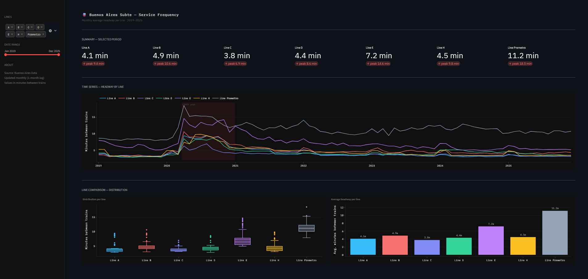

# Buenos Aires Subte — Frequency Analysis

Exploratory analysis of Buenos Aires subway service frequency from 2019 to 2025, with an interactive Streamlit dashboard.

**Dataset:** [Buenos Aires Data — Frecuencia del Subte](https://data.buenosaires.gob.ar)  
**Coverage:** January 2019 – December 2025 · 7 lines (A, B, C, D, E, H, Premetro)  
**Update cadence:** Monthly, with a 1-month lag

---

## What's in this repo

```
├── BsAs_Subway_Analysis.ipynb   # Full analysis notebook
├── app.py                       # Streamlit dashboard
├── style.css                    # Dashboard styles
├── Subway_Frequency.xlsx        # Source dataset
└── README.md
```

---

## Notebook

The notebook walks through the full analysis in four stages:

**Cleaning & transformation**  
The raw dataset stores frequencies as `HH:MM:SS` strings and has mixed date formats (`"YYYY-MM"` strings up to 2024, `datetime` objects from 2025). Both are normalized. Placeholder rows for 2026 are dropped. Two missing values in Line D (Jan–Feb 2024) are imputed with the Q1 2024 median. Values above 30 minutes are capped as outliers.

**Descriptive stats**  
Distribution and average headway per line across the full period.

**COVID-19 impact**  
The ASPO lockdown (March 20, 2020) caused a ~130% degradation in Line A headway — from ~3 min to ~9 min. All lines show the same pattern simultaneously, suggesting a system-wide operational decision rather than demand-driven adjustments. Recovery took most of 2021.

**Seasonality**  
Holiday months (Jan, Feb, Jul) show slightly higher headways. A t-test confirms the effect is statistically significant for some lines but not uniform across the network.

---

## Dashboard



Interactive Streamlit app with:
- **Line selector** — filter by any combination of lines
- **Date range slider** — zoom into any period
- **Time series** — headway evolution with COVID band annotation
- **Distribution boxplot** — spread and outliers per line
- **Average headway bar chart** — quick comparison across selected lines

### Run locally

```bash
pip install streamlit plotly pandas numpy scipy openpyxl
streamlit run app.py
```

> `app.py`, `style.css`, and `Subway_Frequency.xlsx` must be in the same directory.

---

## Key findings

- **COVID impact was uniform and immediate.** All lines degraded in lock-step from March 2020, with peak headways 2–3× above baseline. This points to centralized operational policy, not per-line demand response.
- **Recovery was gradual and uneven.** Most lines returned to pre-pandemic levels by mid-2021; Line A not until August 2021.
- **Inter-line correlation is high (>0.8).** The system moves as a block — individual lines have little independent variation outside of structural differences.
- **Line E and Premetro are structural outliers.** Line E consistently runs at ~7 min headway vs. ~4 min for A/C/D. The Premetro averages ~11 min and operates on a different scale entirely.
- **Seasonal signal exists but is weak.** Holiday months average slightly longer waits, but the effect is not statistically significant across all lines.

---

## Stack

| Layer | Tools |
|---|---|
| Analysis | Python 3.10 · pandas · numpy · scipy |
| Visualization (notebook) | matplotlib · seaborn |
| Dashboard | Streamlit · Plotly |
| Data | Buenos Aires Data (Open Data BA) |
